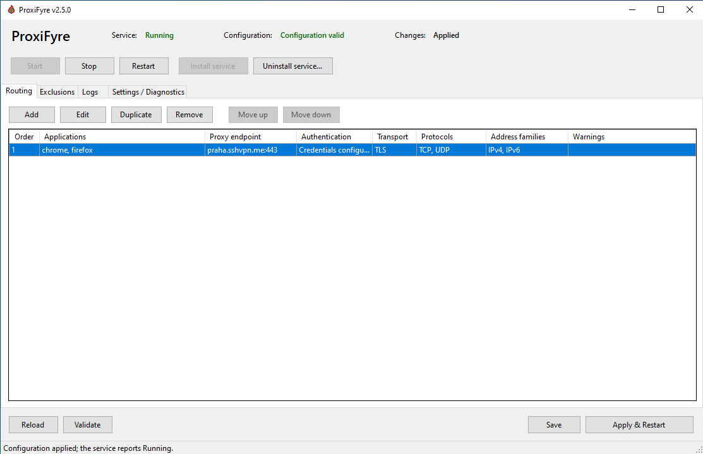
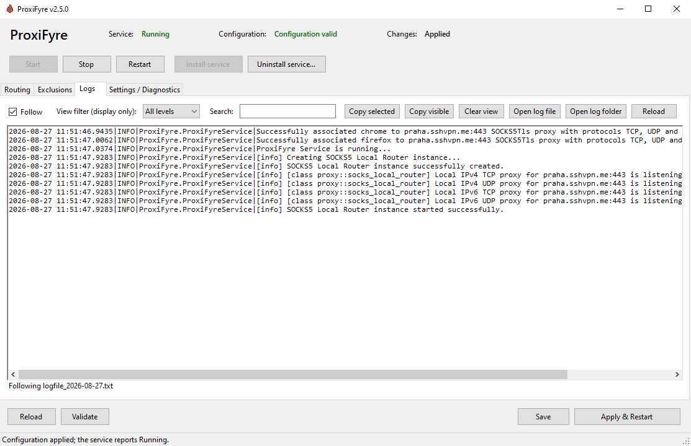

# ProxiFyre

[](https://github.com/wiresock/proxifyre/releases/latest)
[](https://github.com/wiresock/proxifyre/actions/workflows/main.yml)
[](LICENSE)

**A transparent TCP and UDP SOCKS5 proxifier for Windows, with a Windows GUI and service support.**

> **Companion project: [Alighieri](https://github.com/wiresock/alighieri)** — a SOCKS5-over-TLS companion for ProxiFyre that provides compatible TLS-enabled SOCKS5 listeners.

ProxiFyre transparently routes selected Windows applications—or all unmatched applications—through one or more SOCKS5 proxies. It builds on the Windows Packet Filter `socksify` demo and adds production-oriented configuration, UDP and IPv6 routing, SOCKS5-over-TLS, service operation, and an elevated management GUI.

## Highlights

- Route applications that have no native proxy support, including UDP and QUIC traffic.
- Use multiple ordered SOCKS5 proxies with per-application rules and exclusions.
- Proxy IPv4 and IPv6 destinations over TCP, UDP, or both.
- Choose normal SOCKS5 or TLS transport, with certificate validation and optional pinning.
- Keep local network traffic direct with LAN bypass.
- Configure, validate, apply, monitor, and troubleshoot through the Windows GUI.
- Run unattended as `ProxiFyreService` with notification-area controls.

[](docs/images/proxifyre-ui-routing.png)

## Install

Download the architecture-matched package from [GitHub Releases](https://github.com/wiresock/proxifyre/releases/latest).

| Package | Intended use |
| --- | --- |
| `ProxiFyre-<version>-win-x86-setup.exe`, `...-x64-setup.exe`, or `...-arm64-setup.exe` | **Recommended.** Online setup that acquires verified Visual C++ and Windows Packet Filter prerequisites when needed. |
| `ProxiFyre-<version>-win-x86.msi`, `...-x64.msi`, or `...-arm64.msi` | Managed deployment after all prerequisites have already been provisioned. It does not download them. |
| `ProxiFyre-v<version>-x86.zip`, `...-x64.zip`, or `...-ARM64.zip` | Application payload only. It is not an offline installer and requires protected manual staging. |

Before running setup, install:

- **x86/x64:** .NET Framework 4.7.2 or later.
- **ARM64:** .NET Framework 4.8.1 or later.

Setup does not install .NET Framework. ProxiFyre's first-party packages are deliberately unsigned, so Windows may show **Unknown publisher**. Verify the selected artifact against its `.sha256` sidecar before elevation.

After installation:

1. Open **ProxiFyre** from the Start Menu.
2. Add a routing rule and enter the SOCKS5 endpoint and optional credentials.
3. Select the required protocols, address families, and transport.
4. Choose **Validate**, then **Apply & Restart**.
5. Confirm that the header reports **Running**. With engine logging set to `Info`, `Debug`, or `All`, the Logs tab also shows the loaded-rule summary.

The installer registers the service but intentionally leaves it stopped until a valid configuration is available.

### Windows 7

Windows 7 is supported only with Service Pack 1. A fully patched image with current servicing-stack and SHA-2 support updates, followed by a reboot after applicable updates, is the recommended baseline. Setup includes narrowly scoped compatibility handling for legacy WinINet behavior while retaining digest verification of downloaded prerequisites. See the [installer documentation](docs/installer.md#windows-7-baseline) for the exact behavior and limitations.

### Optional unelevated console mode

Portable launchers can opt into a limited interactive mode after Windows Packet Filter is installed:

```console
ProxiFyre.exe --allow-not-admin
```

The switch is exact and case-sensitive. This mode cannot install, start, stop, or remove the Windows service. Process attribution is best effort without administrator rights: traffic whose owner cannot be resolved—which may include protected, elevated, system, or other-user processes—remains direct even when a catch-all rule is configured. Treat this as a compatibility mode for selected applications, not a strict current-user security boundary. See the [configuration reference](docs/configuration.md#optional-unelevated-console-mode) for details.

## Configuration

The GUI edits `app-config.json` beside `ProxiFyre.exe`. A minimal configuration looks like this:

```json
{
  "logLevel": "Info",
  "bypassLan": true,
  "proxies": [
    {
      "appNames": ["chrome", "firefox"],
      "socks5ProxyEndpoint": "proxy.example.com:1080",
      "socks5Transport": "TCP",
      "supportedProtocols": ["TCP", "UDP"],
      "supportedAddressFamilies": ["IPv4", "IPv6"]
    }
  ],
  "excludes": []
}
```

Rules are evaluated from top to bottom and the first match wins. Put the catch-all rule (`"appNames": [""]`) last; exclusions take priority over every routing rule. Unsupported destination address families are blocked rather than allowed to leak directly.

See the [configuration reference](docs/configuration.md) for matching rules, authentication, LAN bypass, logging, TLS options, and complete examples. The repository also includes a ready-to-edit [sample configuration](app-config.sample.json).

## Windows GUI

The GUI manages the existing engine rather than processing packets itself. It can edit and atomically save configuration, install or remove only the service registration, start and stop the service, follow logs, inspect resolved paths and versions, and remain available in the notification area. Only one GUI instance runs per Windows identity and terminal session.

[](docs/images/proxifyre-ui-logs.png)

**Save** updates the configuration but does not restart a running service. **Apply & Restart** saves and waits for the actual Windows service result. The engine log level is a configuration setting and takes effect after a service restart; the Logs-tab view filter changes only what is displayed.

For path discovery, rollback behavior, service controls, log following, notification-area behavior, troubleshooting, and release validation, see the [GUI documentation](docs/gui.md).

## SOCKS5 over TLS

Set `socks5Transport` to `"TLS"` to protect the SOCKS5 TCP connection and UDP `ASSOCIATE` control channel. Public certificates use normal Windows certificate and hostname validation. For a self-signed endpoint, prefer an exact `tlsPinnedSha256` leaf-certificate pin instead of disabling certificate validation.

[Alighieri](https://github.com/wiresock/alighieri) provides a compatible SOCKS5-over-TLS listener for ProxiFyre.

## Important limitations

- The SOCKS5 server endpoint must be reachable over IPv4: use an IPv4 literal or a hostname with an A record. Destination traffic may still be IPv4, IPv6, or both.
- IPv6 proxying requires working IPv6 connectivity on the client and a SOCKS5 server that accepts IPv6 targets (`ATYP=4`). ProxiFyre redirects packets the application emits; it does not create IPv6 connectivity.
- Fragmented IPv6 datagrams are passed through directly to avoid corrupting partial packets. Applications that emit oversized fragmented UDP datagrams can therefore bypass the proxy.
- SOCKS5 usernames and passwords are stored in plaintext in `app-config.json`, although the GUI masks and redacts them from its diagnostics.
- The MSI creates program-specific inbound TCP and UDP firewall rules for `ProxiFyre.exe` because redirect listener ports are allocated dynamically.

## Documentation

- [Configuration reference](docs/configuration.md)
- [GUI architecture, behavior, and troubleshooting](docs/gui.md)
- [Installer, deployment, release workflow, and package verification](docs/installer.md)
- [Sample configuration](app-config.sample.json)

## Building from source

Development requires Visual Studio 2022 with the C++ and .NET desktop workloads, the v143 toolset, the .NET Framework 4.7.2 targeting pack, NuGet CLI, PowerShell 7, a .NET SDK, and the repository's vcpkg dependencies.

The exact restore, Release build, test, and packaging commands are maintained in [docs/gui.md#build-and-test](docs/gui.md#build-and-test) and [docs/installer.md#building-installers](docs/installer.md#building-installers). The authoritative project version is `ProxiFyreReleaseVersion` in [Directory.Build.props](Directory.Build.props).

## License

ProxiFyre is licensed under the [GNU Affero General Public License v3.0](LICENSE). Windows Packet Filter and the Microsoft Visual C++ runtime are separate third-party dependencies distributed under their own terms.
